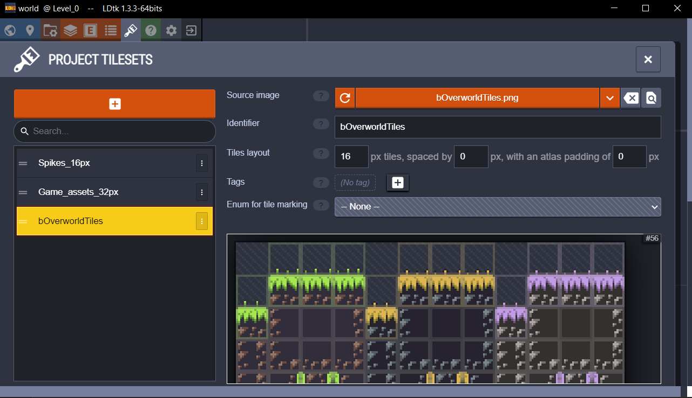
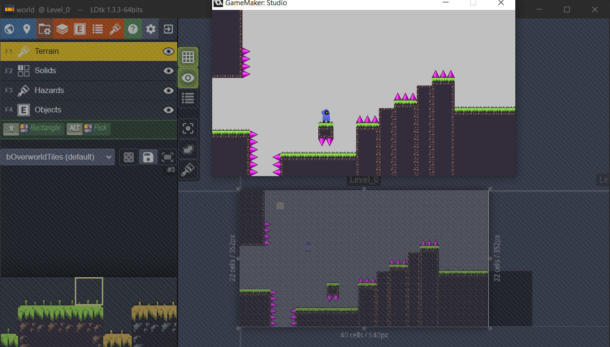

# Placing tiles
For LDtk tilesets to be bound to your game they need to have their identifier be equal to that of the corresponding background asset.
You can refer directly to the background resource image in the backgrounds folder of your Gamemaker project.
Although, note that if you rename the background resource later on then you'll have to update the identifier in your LDtk project too.

Now create a tile layer, assign the tileset to it and it should pop up in your game.
