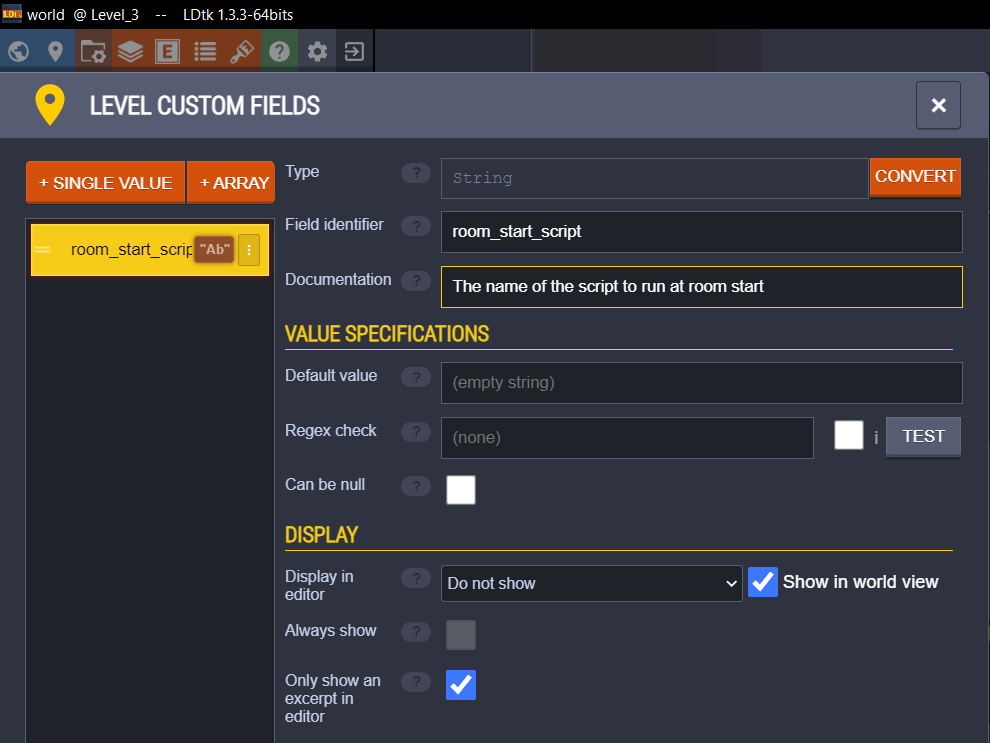
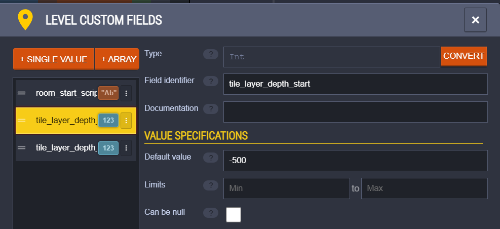

# Other features

## Room start script
You can run a script of your choosing on room start by adding the "room_start_script" field to your level/world.

## Tile layer depth
LDtk-gms will not set the depth of instances. It will only set the depth of tiles.
You may control the depth of tile layers by setting two level fields:
- "tile_layer_depth_start" (default: -50)
- "tile_layer_depth_increment" (default: 100)
The uppermost tile layer will have tile_layer_depth_start as its depth.
Then tile_layer_depth_increment will be added to the depth for every consecutive tile layer.

You can set these values up by going into level custom fields and adding them as integer fields.
