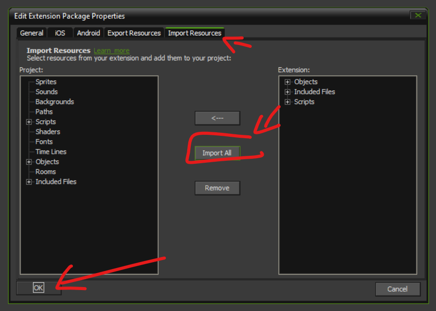

# Install instructions
1) Drag ldtk .gmez (gamemaker extension file) into IDE.

2) Right-click on extension in IDE and open the properties. 

3) Import all the resources in the extension from the import tab in the properties window

After completing this step a bunch of scripts, objects, and a included files should have appeared in you project.

4) Drag Apollo .gmez into IDE (no importing required)

5) Drag nsfs .gmez into IDE (no importing required)

6) Create a directory for ldtk files in your project's included files by right clicking included files and adding a group

7) Create an empty world in ldtk, save it, and then add it to the project through the IDE.
Your included files directory (datafiles in the explorer) should now look like this:

8) Initialize ldtk-gms by calling ldtk_init at the beginning of the game
The world_directory parameter should be a path pointing to the folder you just created in your included files.

9) Place the objLdtkWorldManager object into a room into which you would like to load your world object.
   And set the path to your ldtk world file by setting the world_path parameter in the creation code.

10) Open ldtk_config.json in your included files directory and set the project_directory value to the absolute path pointing to your gamemaker project root folder.
Example on my local machine:

11) Finish reloading setup
When running the game now you should get no errors. After ldtk_init() has been run there should be a new file called "save.bat" in your worlds folder (not in gamemaker but in your actual files). This file contains a command that needs to be run every time you save in LDtk. Luckily, LDtk has an option to run a command on every save.
- Go to LDtk project settings -> User Custom Commands -> Custom commands
- Add a new custom command, set it to run after saving.
- Input "save.bat"

In order to finish setting up LDtk live reloading you'll need to call
The project should now start without errors.
When you're in the room with the world object you should be able to press the world reload key (default is "0") and have the reload prompt text show up in the bottom right corner of the UI.

See the troubleshooting guide if something goes wrong during the setup.
In order to start placing objects into your LDtk world and load them into you room start following the "getting started" guide.