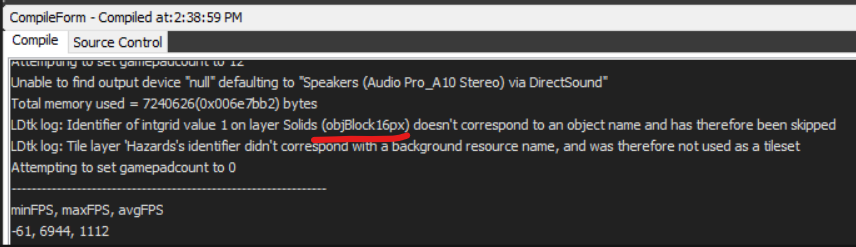

# Tips and tricks

## General assets sprite page
When you want your entities to have the same sprites as they do in the game you might be tempted to add a tileset for each sprite directly from your game's sprites folder.
My recommendation is to create a big image file that you add your object sprites to as you go.
Then you can just create a single LDtk tileset from that and refer to it in all/most of your entities.

## Check the Gamemaker output
Usually when things go wrong or generally when LDtk-gms detects something it will put messages in the output log. Example: I changed the name of my block from objBlock16px to objBlock, which made the entity name in the LDtk world not match up anymore. In the output log it told me that the entity identifier doesn't match up with any existing object name. So check the output log when things don't go as you expect.

