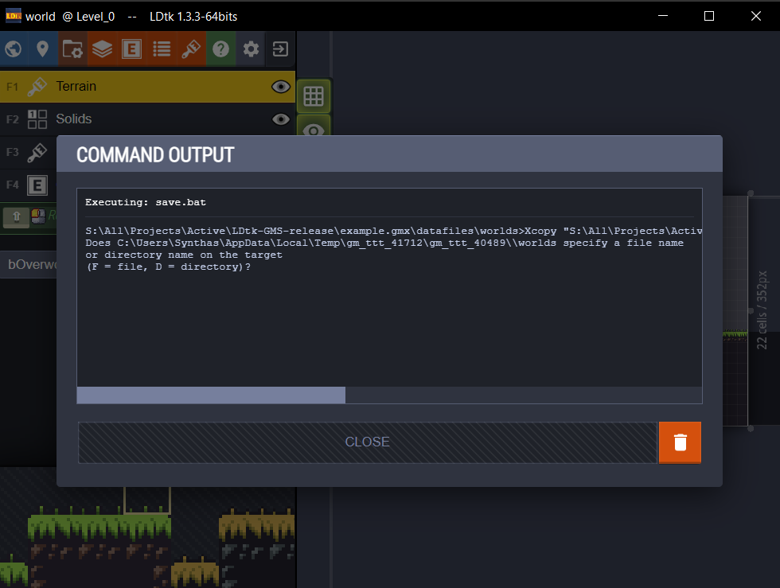

# Troubleshooting:
## Apollo extension couldn't load
https://itch.io/t/2824794/v2-extension-wont-load-but-only-for-some-users

## Files missing after importing extensions
Using "save as..." to open a copy of a project can confuse Gamemaker into thinking you're working in another directory. This can result behavior like new included files being dropped in the project that you were in before saving to the new location.

Whatever the case, just make sure you open your project by opening a fresh instance of Gamemaker instead of using a previously open instance.

## Executing save.bat when the game is not running
Often results in the following error message:

This just means that the command couldn't save to where the game would be if it were running.
Your LDtk world still saved fine, just dismiss the error.