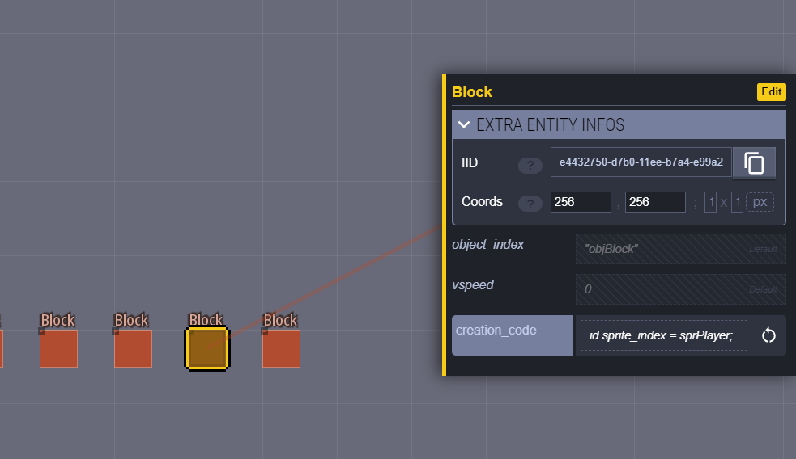

# Getting started
In order for anything in the LDtk world to be able to appear in your room a link must be established. This is done in a few different ways. This document will go over all of them.

This tutorial wont teach LDtk specific concepts. I'd encourage you to familiarize yourself with the basics of LDtk by playing around in the editor.

Remember that throghout this tutorial you'll be able to reload your LDtk world after saving and having your changes applied to your running Gamemaker game by pressing the reload key (default = 0).

## Objects
There are a few ways to place instances using LDtk they vary depending on your preferred amount of flexibility versus convenience.

### Entity instances (flexible)
#### Creating in entity instance
The most flexible way to add an instance is using Entities.
The general rule is: if you need creation code for an instance, then you should use an entity.

1) Create an entity
2) Add a single string value to it and call it object_index
3) Put the name of the object into the "Default value" field

#### Changing a variable of an entity instance using fields
To change instance variables add more fields and name them after the variable you want to change.

The limitation to this is that you cannot easily reference other gamemaker resources. Example: you want to set the sprite index.
- You create a string field and name it "sprite_index"
- You set the value to "sprPlayer"
Doing the above would be equivalent to writing the following GML:
`sprite_index = "sprPlayer;"`
Which is not the same as writing:
`sprite_index = sprPlayer;`
Because if sprPlayer is a sprite then referencing it in GML actually becomes a number, not a string. However, this problem can be solved by adding creation code.

#### Calling functions and referencing resources using lua
To run creation code on your instance you can add a "multilines" field to your entity. Name the field "creation_code". You can have LDtk add basic syntax highlighting by setting the language field to lua.

Now you can write code that references your sprite

Note that in order to reference the instance's sprite index you'll have to use "id". Just doing `sprite_index = sprPlayer` will not set the sprite_index. It boils down to "Lua is not GML". For further explanation see the Lua limitations document. By default in LDtk-gms you'll be able to reference all sprites, objects, sounds, rooms, scripts, and paths in Lua - see the lua bindings folder in ldtk gms scripts folder to see how this works (specifically lua_ref_resources_init).

### Tile instances (convenient)

### Tilemap bound instances (special)

## Tiles

## Limitations
