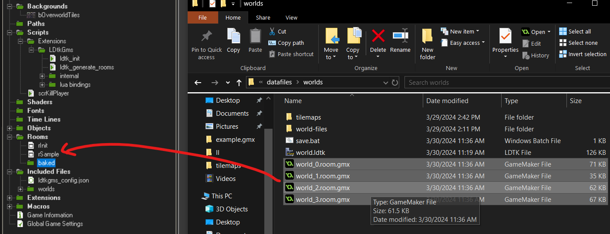

# Creating Gamemaker rooms
When you're done editing your game in LDtk you might wanna convert your LDtk world to regular gamemaker rooms.
After all, loading a massive json file when traversing the game's levels is a CPU intensive process.

1) Call `ldtk_generate_rooms(< path to world >)` after ldtk_init
2) Locate the generated rooms in your datafiles folder
3) Drag the rooms into your gamemaker project

