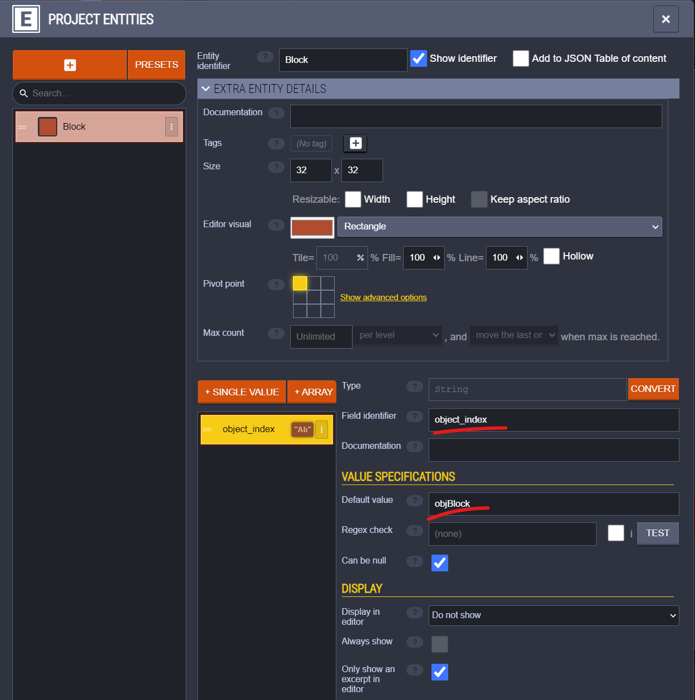
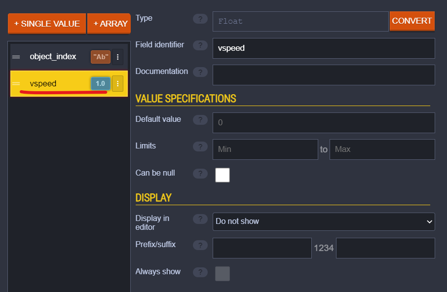

# Getting started
In order for anything in the LDtk world to be able to appear in your room a link must be established. This is done in a few different ways. This document will go over all of them.

This tutorial wont teach LDtk specific concepts. I'd encourage you to familiarize yourself with the basics of LDtk by playing around in the editor.

Remember that throghout this tutorial you'll be able to reload your LDtk world after saving and having your changes applied to your running Gamemaker game by pressing the reload key (default = 0).

## Objects
There are a few ways to place instances using LDtk they vary depending on your preferred amount of flexibility versus convenience.

### Entity instances (flexible)
The most flexible way to add an instance is using Entities.
The general rule is: if you need creation code for an instance, then you should use an entity.

1) Create an entity
2) Add a single string value to it and call it object_index
3) Put the name of the object into the "Default value" field

To change instance variables add more fields and name them after the variable you want to change.

### Tile instances (convenient)

### Tilemap bound instances (special)

## Tiles