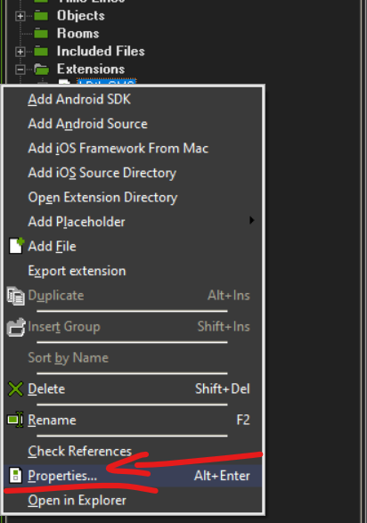
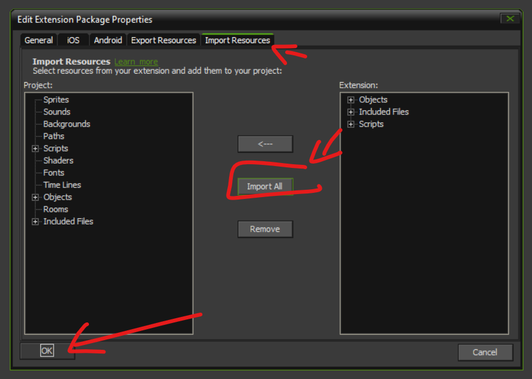
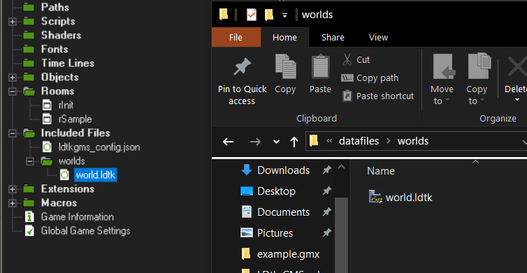
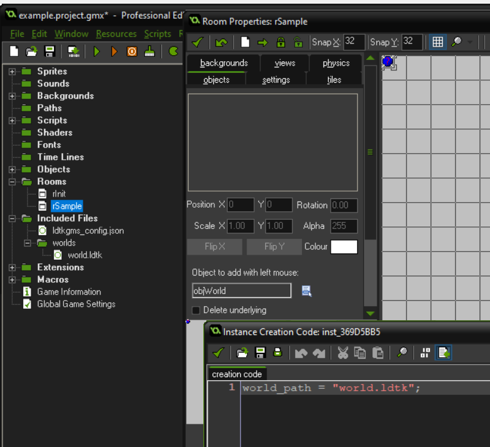

1) Drag ldtk .gmez (gamemaker extension file) into IDE.
2) Right-click on extension in IDE and open the properties.

3) Import all the resources in the extension from the import tab in the properties window

After completing this step a bunch of scripts, objects, and a included files should have appeared in you project.
4) Drag Apollo .gmez into IDE
5) Drag nsfs .gmez into IDE
6) Create a directory for ldtk files in your project's included files by right clicking included files and adding a group
7) Create an empty world in ldtk, save it, and then add it to the project through the IDE.
Your included files directory (datafiles in the explorer) should now look like this:

8) Initialize ldtk-gms by calling ldtk_init at the beginning of the game
The world_directory parameter should be a path pointing to the folder you just created in your included files.
9) Place the objLdtkWorldManager object into a room into which you would like to load your world object.
   And set the path to your ldtk world file by setting the world_path parameter in the creation code.
